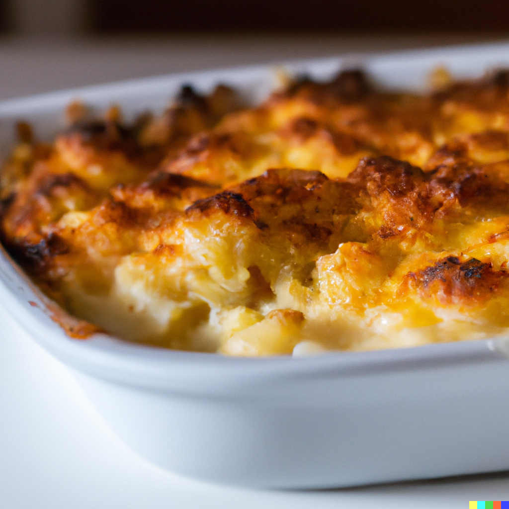

Cauliflower cheese is a very popular dish, which can either be served as a side or a main! The cheese sauce compliments the cauliflower perfectly, binding them together into soft, golden, tangy goodness. 

Prep time: 10 mins

Cook time: 30 mins

Servings: 4 to 5 people

## Ingredients

* 1 large head of cauliflower, cut into florets
* 2 tbsp. unsalted butter
* 2 tbsp. all-purpose flour
* 2 cups whole milk
* 1 tsp. dry mustard powder
* Salt and pepper to taste
* 2 cups grated cheddar cheese
* 1/4 cup breadcrumbs

## Method

1. Preheat the oven to 375°F. Grease a 9x13 inch baking dish.
2. Boil the cauliflower florets in salted water for 5-7 minutes, or until tender. Drain and set aside.
3. In a saucepan, melt the butter over medium heat. Whisk in the flour and continue whisking for 1-2 minutes, until the mixture is smooth and bubbly.
4. Gradually add the milk, whisking constantly, until the sauce has thickened, about 5 minutes.
5. Stir in the dry mustard powder, salt, and pepper. Remove the saucepan from heat.
6. Stir in the grated cheddar cheese, making sure that the cheese is melted and the sauce is smooth.
7. Pour the cheese sauce over the boiled cauliflower florets, making sure that the florets are evenly coated.
8. Sprinkle the breadcrumbs over the top of the cheese sauce.
9. Bake for 25-30 minutes, or until the top is golden brown and the sauce is hot and bubbly.
10. Serve the creamy, cheesy cauliflower cheese as a side dish, or as a main dish with crusty bread or a salad. Enjoy!

## Tips

* For better, deeper taste, roast the cauliflower in the oven for 15 minutes, before adding the cheese sauce on top. Any neutral-tasting oil, like vegetable oil, works wonders to bring out the best flavour of the vegetable.