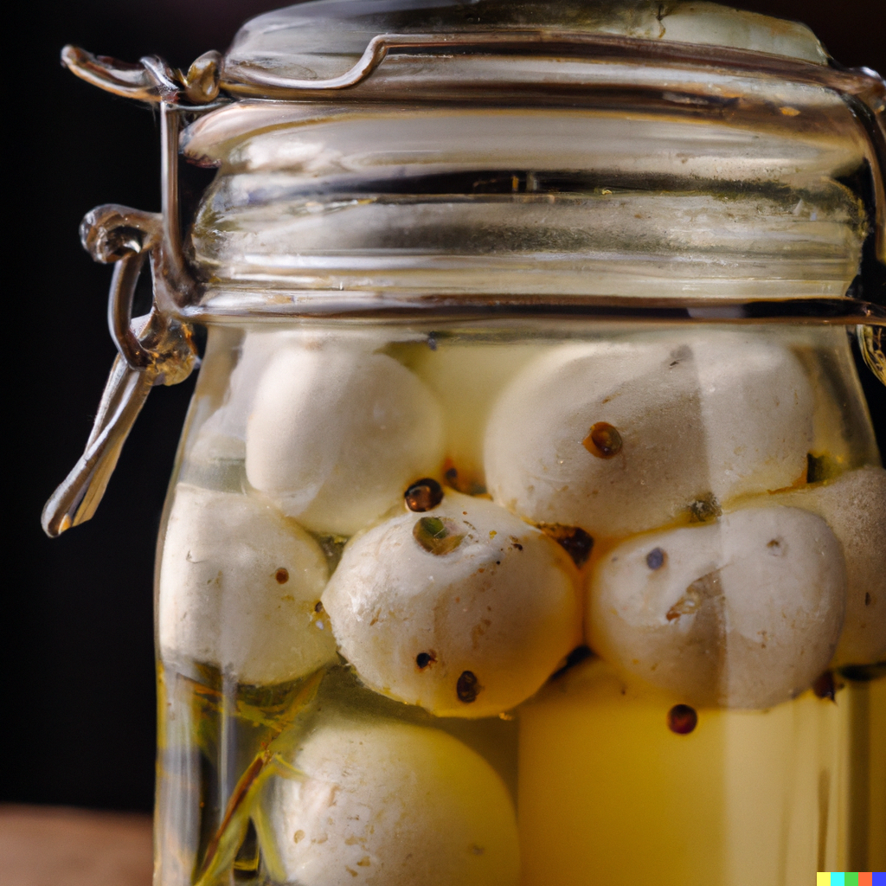

Although this is not a complex recipe, this fresh, zesty treat can really make a difference at the breakfast table. Because this is made with very simple ingredients, it allows for endless customising possibilities, making it the perfect gift, or side on a cheese board. 

Prep time: 15 mins

Difficulty: easy

Serves: 2 to 3 small (250ml) jars

## Ingredients

* 1 round of goat's cheese, about 8 oz (230g)
* 1/2 cup extra-virgin olive oil
* 1/4 cup balsamic vinegar
* 1 tsp. Dijon mustard
* 1 clove of garlic, minced
* 1 tsp. honey
* 1 tsp. dried basil
* 1 tsp. dried oregano
* Salt and pepper to taste

OR 

* 2 rounds of goat's cheese (about 4 oz. each)
* 1/2 cup extra virgin olive oil
* 2 tbsp. red wine vinegar
* 2 cloves of garlic, minced
* 1 tsp. dried thyme
* 1 tsp. dried rosemary
* Salt and pepper to taste

## Method

1. In a small bowl, whisk together the olive oil, balsamic vinegar, Dijon mustard, minced garlic, honey, dried basil, dried oregano, salt, and pepper to make the marinade. Alternatively, whisk together the olive oil, red wine vinegar, minced garlic, thyme, rosemary, salt and pepper to make the other version of the marinade. 
2. Place the goat's cheese in a shallow dish and pour the marinade over the cheese. Make sure that the cheese is completely covered in the marinade.
3. Cover the dish with plastic wrap and let the cheese marinate in the refrigerator for at least 2 hours, or overnight if possible.
4. If you want to preserve this, sterilise jars of your preferred size by placing in the oven at low temperature for 10 to 15 minutes. To create an airtight seal, place the cap on and place the jars in boiling water for 5 minutes. 
5. To serve, remove the cheese from the marinade and place it on a serving plate. Drizzle with a little bit of the marinade and serve with crackers or sliced baguette. Enjoy the creamy, tangy, and herby flavor of marinated goat's cheese!