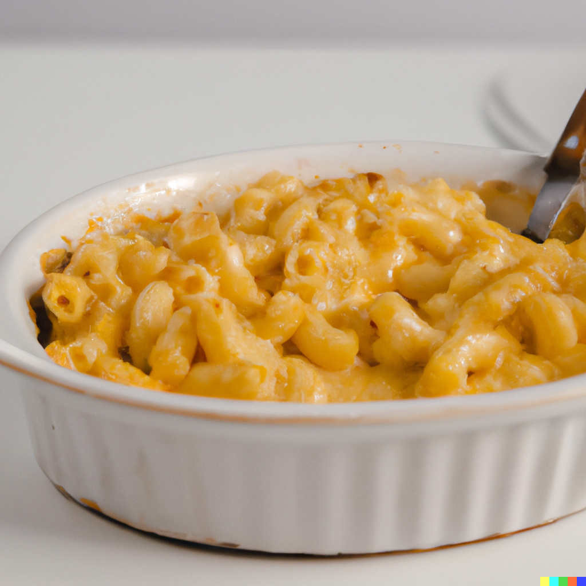

There’s nothing like a good, cheesy comfort dish on a rainy day to get you warm and filled up. I am an avid lover of mac and cheese - one of the easiest and fastest cheese-loaded dishes, which I mastered over the years with the help of my grandma. Although there are many variations of this dish out there, I promise you this will leave your tummy satisfied, and, although not recommended, you might just have to lie down afterwards. 

* Prep time: 15 mins + making pasta (optional)
* Cook time: 20 mins
* Level of difficulty: easy
* Serves: 3 to 4 people

## Ingredients

* 14 oz (400g) elbow macaroni, or any pasta of your choice*
* 5 strips of streaky bacon
* 1 tbsp of vegetable oil (or any neutral tasting oil)
* 3 tbsp butter
* 4 tbsp plain flour
* 2 cups (470ml) whole milk
* 1 tsp salt
* 1 tsp black pepper
* 1 tsp Dijon mustard
* 2 cups (400g) shredded cheddar cheese*
* 1 tsp chilli flakes (optional)

\*This recipe works best with short pasta. If you're making your own pasta, follow the recipe from *Basics - learn to cook from scratch.*

\*\**For a deeper, tanghier taste, use 200g of cheddar and 200g of Gruyere

## Method

1. Preheat your oven to 200°C/392°F. 
2. Add water to a large pot until it’s three-quarters of the way full. Season generously with salt (Kosher salt works best) and bring to a boil. 
3. Once boiling, add your pasta and cook it al dente, usually 8 to 10 minutes for store-bought and 5 minutes for fresh pasta. 
4. Once the pasta is almost cooked, keep one cup of pasta water and drain the rest. Set the pasta and the pasta water aside.  
5. In a large saucepan, add a tablespoon of vegetable oil. Place the bacon strips in the cold pan and cook it over medium heat until crisp. Once cooked, remove from pan, crumble and set aside.
6. In the same saucepan, melt the butter over medium heat. For better flavour, keep the bacon grease from earlier in the pan. Once melted, gradually add the flour, whisking continuously. To prevent lumps, add the flour one bit at a time. Cook for 1 minute, or until the flour has become a dark-golden colour.
7. Gradually whisk in the milk, salt and pepper until the mixture is smooth. Cook for about 5 minutes or until the mixture thickens. At this stage, if the sauce is not thick enough, add some of the pasta water gradually. 
8. Remove from heat and stir in the shredded cheese until melted.
9. Add the cooked pasta to the cheese sauce and stir to combine. Place back on the stove on low heat and stir until the mixture heats up. 
10. Transfer to a serving dish, sprinkle crumbled bacon over the top and serve hot.

## Tips

* Try a combination of easy-to-melt cheeses, when selecting your cheese base (should you want to replace the basic cheddar). Colby, Swiss, Monterey Jack, Smoked Gouda and Fontina, all of which are creamy, buttery and nutty in flavour. 
* Avoid adding heavy cream! Use some of the pasta water after boiling, which will help thicken the sauce, or make a slurry of 1 part water and 1 part cornstarch. This prevents the dish from being too greasy and preserves the cheesy taste!
* In order to prevent lumps, make sure your cheese is freshly grated.